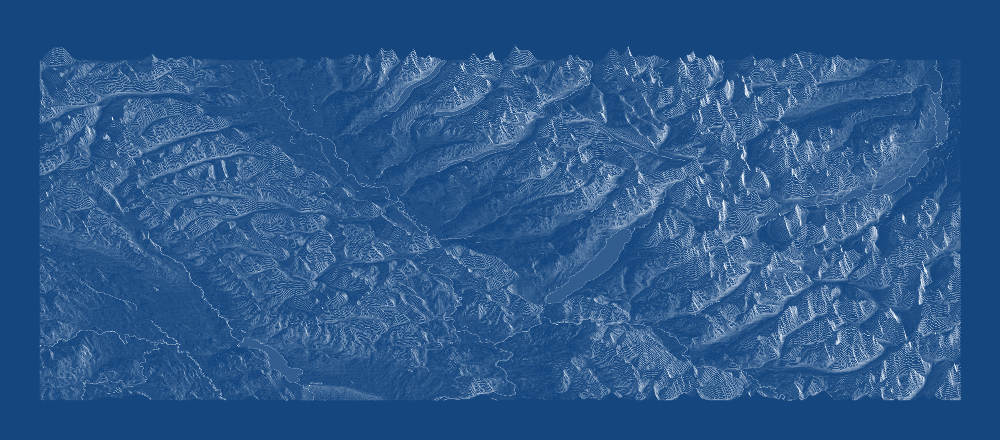

# Raisz-style Relief

A QGIS Processing plugin that turns a DEM into presentation-quality
physiographic relief graphics in the manner of **Erwin Raisz** — oblique
hachured mountains, stippled plains, engraved waters and a decorated map
sheet. The output is a *picture*, not a georeferenced raster: PNG, SVG or
PDF ready for print or for editing in vector software.


---

## What it does

The method follows Alpha & Winter (1971), Raisz (1931) and Ridd (1963):
contour levels are made invisible, every relief point is displaced north
in proportion to its height, and fall lines with light-dependent density
and hidden-surface removal build the oblique view. The higher the
mountain, the taller its profile.


Two algorithms share one decoration layer:

* **Landform map (Hammond + Mower + Alpha)** — hybrid: Hammond
  classification splits mountains (hachured) from plains (stippled),
  with Mower-style generalization. Works at a capped working resolution.
* **Classic physiographic (full resolution)** — uniform engraved
  hachuring across the whole surface at full DEM resolution, with
  automatic strip tiling for very large sheets.

## Features

- Paper/ink presets: sepia, blueprint, cyanotype, old map, plain white,
  diazotype — all line work follows the preset
- Hypsometric fill (Patterson, Bartholomew, Peucker, Imhof) or thematic
  fill colored from the QGIS layer style, draped over the displaced relief
- Separate overlay layers: rivers, lakes, seas, marshes, roads,
  settlements with haloed labels, and five land cover textures
- Engraved hydrography patterns: coastal vignette, lake hatching, marsh tufts
- Auto-sea from the DEM with island holes preserved
- Large-form shading: two-tone lithographic shadow spot **or**
  XIX-century anaglyptography line engraving
- Sheet decoration: frames (including a checkered map border of degree
  fractions), graticule ticks in D°MM′, old-style scale bar, compass rose
  pointing to true north
- Old-print emulation: halftone dot screen, paper grain, color misregistration
- Canvas rotation 0/90/180/270°, relative scene scaling for gentle terrain
- Vector export to SVG/PDF


## Installation

**From the QGIS Plugin Manager** — search for "Raisz-style Relief".

**Manually** — copy the `raisz_relief` folder into your QGIS plugin
directory and enable it in *Plugins → Manage and Install Plugins*:

| OS | Path |
|---|---|
| Windows | `%APPDATA%\QGIS\QGIS3\profiles\default\python\plugins\` |
| Linux | `~/.local/share/QGIS/QGIS3/profiles/default/python/plugins/` |
| macOS | `~/Library/Application Support/QGIS/QGIS3/profiles/default/python/plugins/` |

The algorithms then appear in the Processing Toolbox under
**Raisz-style Relief**.

### Requirements

QGIS 3.28 or newer. All Python dependencies ship with QGIS/OSGeo4W:
numpy, scipy, matplotlib, rasterio, shapely (≥ 2.0), pyproj, affine, GDAL.

---

## Recommendations for use

### Coordinate reference system

**Use a projected, metric CRS** — UTM for a single region, Albers or
Lambert Conformal Conic for a country-sized sheet. The method measures
local relief and slopes in meters, so a geographic CRS (EPSG:4326,
degrees) distorts them badly: one degree of longitude is not one degree
of latitude anywhere except the equator, and the hachures come out
stretched. The landform algorithm warns you when the DEM is in degrees; the Classic
algorithm does not check, so verify the CRS yourself before a long render.

### Which CRS, concretely

Where two options are listed, prefer the conformal one when the relief itself
is the subject: slope and aspect are angular quantities, and a conformal
projection keeps them honest in every direction. Equal-area projections
(Albers, LAEA) stretch one axis and squeeze the other by a percent or two,
which makes the computed slope depend slightly on azimuth — negligible for a
thematic sheet, visible on a pure relief engraving.

| Scene | Recommended CRS | EPSG |
|---|---|---|
| Single region, up to ~6° of longitude | WGS 84 / UTM zone *n*N | 32601–32660 |
| Same, southern hemisphere | WGS 84 / UTM zone *n*S | 32701–32760 |
| Europe, single country | ETRS89 / UTM zone 28N–38N | 25828–25838 |
| Europe, continental sheet | ETRS89-extended / LCC Europe | 3034 |
| Europe, thematic/statistical sheet | ETRS89-extended / LAEA Europe | 3035 |
| Contiguous USA | NAD83 / Conus Albers | 5070 |
| Contiguous USA, conformal alternative | USA Contiguous Lambert Conformal Conic | ESRI:102004 |
| Canada | NAD83 / Canada Atlas Lambert | 3978 |
| France | RGF93 / Lambert-93 | 2154 |
| Great Britain | OSGB36 / British National Grid | 27700 |
| Iceland | ISN93 / Lambert 1993 | 3057 |
| Arctic | WGS 84 / NSIDC Polar Stereographic North | 3413 |
| Antarctica | WGS 84 / Antarctic Polar Stereographic | 3031 |

For a country not listed here, look for its national grid: almost every one is
a Transverse Mercator or a Lambert Conformal Conic centered on the territory,
which is exactly what this method wants. Verify any code at
[epsg.io](https://epsg.io) before relying on it — national grids get
superseded as datums are re-realized.

**Avoid:**

* **EPSG:4326** (WGS 84 geographic) — degrees, not meters. Slopes and local
  relief are meaningless, and the sheet is stretched by 1/cos(latitude).
* **EPSG:3857** (Web Mercator) — metric in name only. It is conformal, so
  angles survive, but its scale factor is 1/cos(latitude): at 60° N one metre
  on the ground spans two metres on the map, while the elevations stay in
  real metres. Every slope is therefore computed about half as steep as it
  is — and the error grows with latitude (×1.4 at 45°, ×2.9 at 70°). Fine for
  a basemap, wrong for terrain analysis.
* **Stitched UTM zones.** A sheet spanning three zones reprojected into one
  of them accumulates several percent of scale error at the edges and swings
  grid north noticeably. Define a custom Transverse Mercator or a conic
  centered on the area instead.

Vector overlays may be in any CRS: they are reprojected to the DEM CRS
and clipped to its extent automatically.

**Match the vertical units to the horizontal ones.** Elevations must be in
metres. A DEM in feet on a metric grid reports slopes 3.28 times too steep,
and the vertical exaggeration you set on top of that becomes meaningless.
Convert with `gdal_calc` (`--calc="A*0.3048"`) before reprojecting, and keep
an eye on US sources in particular — many national products ship in feet
without saying so in the file name.

### Reprojecting the DEM

```bash
gdalwarp -t_srs EPSG:32631 -tr 45 45 -r cubic -tap \
         -dstnodata -9999 srtm_raw.tif dem_utm31n.tif
```

The `-tr 45 45` is the important part: state the pixel size explicitly and
identically on both axes. Without it, gdalwarp derives the resolution from
the source and can hand you an anisotropic grid — a DEM at 39 × 95 m will be
drawn 2.4 times too wide, and no parameter in the plugin can undo that. Check
the result with `gdalinfo` before rendering: *Pixel Size* must be `(45.000,
-45.000)`, the two numbers equal apart from the sign.

Use `-r cubic` for elevation (`near` leaves terracing that the hachures will
faithfully engrave), and set `-dstnodata` explicitly so the gaps are tagged
rather than left as zeros — the plugin's *Areas without data* modes depend on
that tag being present.

Pick the pixel size from the sheet you intend to print, not from the source:
divide the width of the area in meters by the target pixel count. A 300 km
scene at 6,000 px wants 50 m pixels, whatever the SRTM tile happens to offer.

### Scene selection

The plugin performs best in regions with mountainous or strongly
dissected terrain expressed at a regional scale. Weakly dissected
lowland areas may produce less convincing results. For a more balanced
composition, select scenes with lowland terrain in the foreground or use
view rotation to bring the plains forward.

### Resolution

**Which resolution is this about?** The figures below describe the DEM you
feed in and the sheet you get out — not the *Working resolution* parameter.
The two coincide for the **Classic** algorithm, which always renders at the
DEM's own resolution. The **landform** algorithm is different: it resamples
internally to *Working resolution*, a separate setting with its own ceiling
of 6,000 px (default 2,000). So "aim for 6,000 px" is advice about your
source raster; with the landform algorithm you must also raise *Working
resolution*, or a 6,000 px DEM will still be drawn at 2,000.

**Aim for about 6,000 px on the longer side of the DEM.** This is the
sweet spot where the engraving reads as line work rather than as noise
or as coarse scribble:

- Below ~2,000 px the strokes become sparse and the framework blocky.
- Around 6,000 px, you get a dense, even texture that prints beautifully
  at A2–A1 sizes and still renders in a few minutes. The progress bar may
  appear to freeze at 40–50%; this is normal.
- Above ~12,000 px the gain is marginal, while memory and time grow
  quadratically. This ceiling concerns the **Classic** algorithm, which works
  at the DEM's own resolution; use strip mode (see below) if you go there
  anyway. The landform algorithm never reaches it — its internal cap is
  6,000 px.

The **landform algorithm** resamples internally to *Working resolution*
(default 2,000 px) — raise it to 3,000–4,000 px for a final sheet. The
**Classic algorithm** always works at full DEM resolution, so prepare
the DEM at the intended output size: resample it beforehand rather than
feeding it a 30,000 px raster. Without strip tiling (see below), very
large scenes may take several hours to render and can exhaust available
RAM.

Match the DEM resolution to the sheet, not to the source data: a
1-arcsecond SRTM tile of a whole country is far more detail than a
printed sheet can hold, and downsampling it first produces a cleaner,
faster, more Raisz-like result.

### Memory and large sheets (classic algorithm)

Leave *Strip height* at 0 and set a realistic *Memory limit* (default
8 GB). If the estimate exceeds the limit, strip tiling switches on
automatically and the sheet is built in horizontal strips at full
resolution without ever holding the whole DEM in memory. In strip mode
the fill, decoration, shading and engraving are computed once on a
downsampled grid, so they cost almost nothing.

Note: canvas rotation is not applied in strip mode yet.

### Gentle terrain

Low hills, plateaus and steep-but-low coastal cliffs render poorly with
absolute settings — the displacement is tiny and the sheet looks empty.
Turn on **Relative scene scale**: the displacement is normalized so the
relief reaches a target share of the sheet height (12 % by default), and
the contour interval is derived from a number of elevation belts instead
of meters. In this mode set *Vertical exaggeration* to about **1.0** —
it acts as a multiplier on the target, and the default 2.2 doubles it.

Add **Relative slopes** if the line work is still sparse: stroke cutoff
and weight come from scene percentiles instead of fixed 4°/45°. The
trade-off is that stroke weight is no longer comparable between sheets.

> **Warning:** Relative Slope and Scale Mode are highly experimental.
> This option is being developed primarily for small, large-scale scenes.
> It may produce highly unpredictable results, often bearing little
> resemblance to the appearance you intended.

### Vertical exaggeration and view

Start at 2.0–2.5 in absolute mode. Higher values look dramatic but
occlude the terrain behind ridges — the hidden-surface removal will
simply delete it. Lower the *View angle* for a flatter, more panoramic
sheet; raise it toward 60–70° for something closer to a plan.

Mountains displaced upward deliberately overlap the top frame — that is
the authentic panoramic-map effect, not a bug.

### Style

- Keep the sheet monochrome (fill = *None — paper only*) for the closest
  match to Raisz's originals; water and roads then differ by pattern, not
  by color, which is the whole point of the manner.
- Turn decoration on gradually — frame, then graticule, then scale bar
  and compass. Everything is off by default so you can judge each addition.
- Hydrography patterns and land cover textures are expensive on huge
  polygon sets; test on a small extent first.https://github.com/iwojima-dev/Raisz_relief_QGIS/blob/main/README.md
- **Anaglyptography** works best either *instead of* fall lines (disable
  hachures, keep the framework) or *under* them with small spacing and
  low intensity.



### Vector output

Choose `.svg` or `.pdf` in the output file dialog. Line work exports as
true vectors; fills, dot screen and paper grain are embedded as raster
underlays, so files grow. Color misregistration is PNG-only and is
skipped for vector formats.

---

## Documentation

Full parameter reference: [docs/PARAMETERS.md](docs/PARAMETERS.md).
Version history: [CHANGELOG.md](CHANGELOG.md).

## References

- Raisz, E. (1931). The physiographic method of representing scenery on maps. *Geographical Review*, 21(2), 297–304.
- Alpha, T. R., & Winter, W. (1971). *Cartographic technique: block diagrams*. USGS.
- Ridd, M. K. (1963). The proportional relief landform map. *Annals of the AAG*, 53(4), 569–576.
- Hammond, E. H. (1964). Analysis of properties in land form geography. *Annals of the AAG*, 54(1), 11–19.

## License

GNU General Public License v3.0 or later — see [LICENSE.md](LICENSE.md).

Copyright (C) 2026 Maksim Boiko
